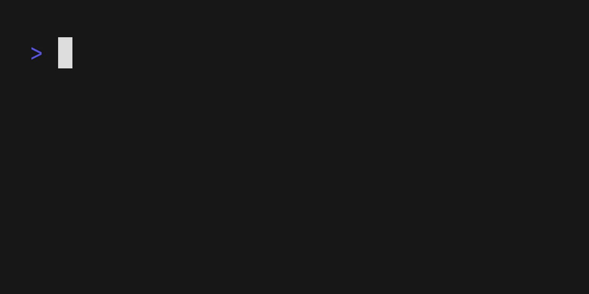

<p align="center">
  <a href="https://github.com/blacktop/bottle-bomb"></a>
  <h1 align="center">bottle-bomb</h1>
  <h4><p align="center">Homebrew Bottle Downloader</p></h4>
  <p align="center">
    <a href="https://github.com/blacktop/bottle-bomb/actions" alt="Actions">
          </a>
    <a href="https://github.com/blacktop/bottle-bomb/releases/latest" alt="Downloads">
          </a>
    <a href="https://github.com/blacktop/bottle-bomb/releases" alt="GitHub Release">
          </a>
    <a href="http://doge.mit-license.org" alt="LICENSE">
          </a>
</p>
<br>

## Why? 🤔

Sometimes I want to use [homebrew](https://brew.sh) to quickly grab something, in a VM for example, and don't want to have to install the *WHOLE* client.


## Getting Started

### Install

```bash
brew install blacktop/tap/bottle-bomb
```

Or

```bash
go install github.com/blacktop/bottle-bomb@latest
```

### Download `bat` bottle

```bash
bottle-bomb bat
```



## License

MIT Copyright (c) 2024 **blacktop**